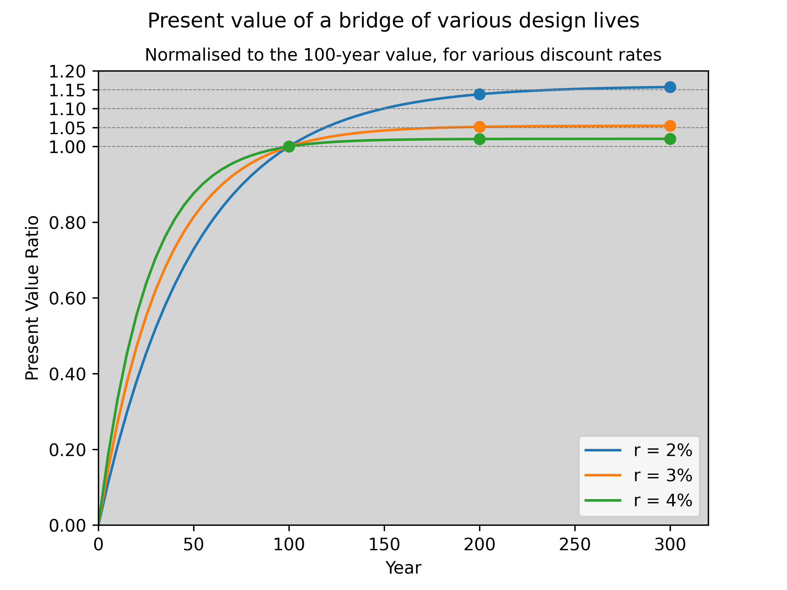

# NPV of Ultra-Long Bridge Design Lives

Does extending bridge life from 100 to 300 years make economic sense? This analysis tests the case using net present value (NPV).

## The question

There's growing discussion in the bridge engineering industry about pushing design lives to 200-300 years. Before getting into carbon or resilience arguments, this repo tests whether ultra-long design life makes sense on pure time-value economics alone.

## Approach

A simple thought experiment:

- A 100-year bridge and a 300-year bridge deliver the same annual benefit.
- Standard discount rates between 2% and 4% (per [KPMG recommendations](https://assets.kpmg.com/content/dam/kpmgsites/au/pdf/2021/infrastructure-project-investment-discount-rate.pdf)).

The present value of a constant annual benefit $B$ over $N$ years at discount rate $r$ is:

$$PV = B \cdot \frac{1 - (1+r)^{-N}}{r}$$

At typical infrastructure discount rates, benefits beyond ~150-200 years are heavily diluted. The additional 200 years of a 300-year bridge add very little present value.

## Key takeaway

A 300-year bridge only makes economic sense if it costs marginally more than the 100-year option. If the life extension requires similar structural forms with improved detailing and durability, it can work. But if it requires significantly more material, more complex structural systems, or reduced adaptability, the NPV case weakens quickly.

**Durability is good. But durability has to be economically efficient.**

## Limitations

This analysis is deliberately narrow. It assumes constant annual benefit, no replacement costs, and typical infrastructure discount rates. It doesn't account for:

- Avoided replacement disruption and construction risk
- Embodied carbon from multiple replacement cycles
- Social discount rates (which are often much lower)
- The asymmetry of error costs
- Future construction capability uncertainty

## Usage

Open `npv-bridges.ipynb` in Jupyter to run the analysis and generate the plot.

If you don't have Python, you can [run this notebook in your browser here](https://mybinder.org/v2/gh/lukeweatherstone/npv-bridges/main?urlpath=%2Fdoc%2Ftree%2Fnpv-bridges.ipynb).

## Contact

Questions or comments? Feel free to get in touch with me by email (lukeweatherstone@fastmail.com) or on [LinkedIn](https://www.linkedin.com/in/luke-ww/).
